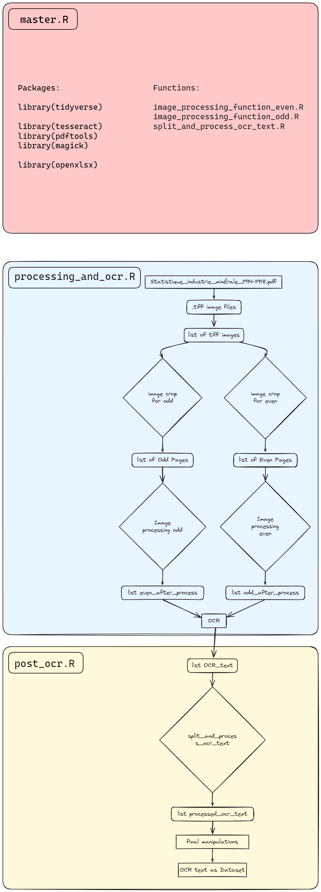

# OCR work on french public archive on mines (1914-1918)


## Disclaimer

This project is a personal endeavor and is provided as-is, without any warranty or guarantee of functionality, accuracy, or reliability. Althouth the project is made to be replicable, the R codes are specific to the pdf of the archives. It is intended for educational and inspirational purposes only.


## Description

This project is a personal initiative to learn ocr, image processing in R and improve on data manipulation.

The goal is to start from a pdf file of the french archive and obtain a proper dataset ready for analysis.

This work is done in 4 steps :

- Import data to R
- Image processing of the images (pages of the pdf)
- OCR of the processed images
- Data manipulation


## Installation

I advice to clone this repo to you local folder.

However, I recommend to keep the folder structure like so:

```
├── data
│   ├── raw            <- Original, untouched data files.
│   ├── output         <- Cleaned and preprocessed data.
│   └── intermediate   <- Intermediate datasets created during the work.
└── code
    ├── scripts        <- Individual R scripts.
    └── functions      <- Reusable R functions.
```


## R code details

The project is done 100% on Rstudio with a dedicated Rproject.

3 scripts are used:

- **master.R** master file, used to import packages and load the functions
- **processing_and_ocr.R** first script: import data, uses image processing function and uses OCR.
- **post_ocr.R** second script: process the returned text of the OCR, do a lot a data manipulation with stringr and export the dataset as an excel file.

3 custom functions are used to keep the scripts nice and clean. They regroup sequences of actions made to their input.

- **image_processing_function_even.R** 
- **image_processing_function_odd.R**
- **split_and_process_ocr_text.R**



